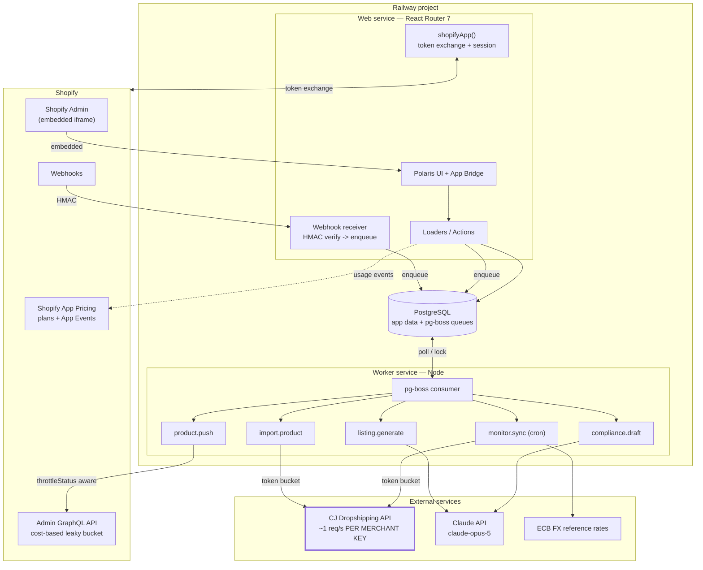
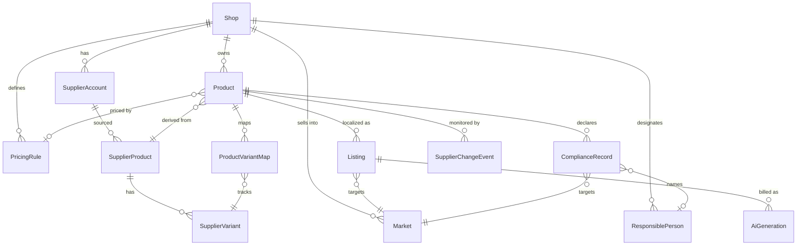
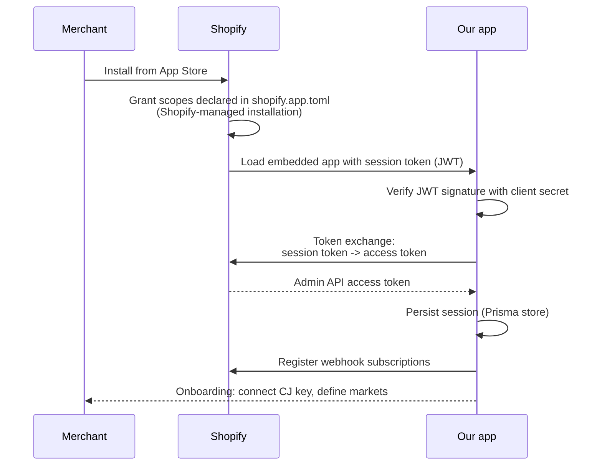

# Architecture — EU Dropshipping Listing App (working name: `hunt`)

> **Positioning (locked in Phase 1):** The Shopify dropshipping app for EU sellers —
> compliant, native-language listings from CJ Dropshipping in one click.
>
> Differentiation angle: **A — EU/GPSR native listings.**

---

## 1. Stack decisions

| Layer | Decision | Rationale |
|---|---|---|
| App framework | **React Router 7** + `@shopify/shopify-app-react-router` | Shopify's current recommended template. The Remix template still exists but React Router is the default path for new embedded apps. |
| UI | **Polaris + App Bridge** | Required for App Store review. Not optional. |
| Language | **TypeScript, strict mode** | Supplier payloads and AI output are both untrusted shapes. Types + runtime validation are the defence. |
| Runtime validation | **Zod** | Every external boundary (CJ payload, Claude JSON, webhook body) parses through a schema. Never trust a shape you didn't create. |
| DB | **PostgreSQL** | Relational data with real constraints. JSONB for raw supplier payloads. |
| ORM | **Prisma** | Already the Shopify template's session store. Good DX, migrations included. |
| Job queue | **pg-boss** (Postgres-backed) — *not BullMQ/Redis* | See ADR-002. |
| AI | **Claude API — `claude-opus-5`** via `@anthropic-ai/sdk` | Listing quality is the product. Metered, not unlimited. |
| Hosting | **Railway** | See ADR-003. |
| FX rates | **ECB daily reference rates** (free, no key, authoritative in the EU) | CJ quotes USD; EU merchants sell EUR. FX is not optional. |

### ADR-001 — React Router, not Remix

Shopify now recommends the React Router template (`@shopify/shopify-app-react-router`)
for new apps. The Remix template remains for non-embedded apps, which we are not.
Starting on Remix means a migration we'd have to pay for later, for zero gain.

### ADR-002 — pg-boss, not BullMQ + Redis

BullMQ is the better queue at high throughput. We do not have high throughput.

- Our supplier ceiling is **1 request/second per merchant**. Throughput is
  bounded by the supplier, not by the queue.
- BullMQ requires Redis: another service, another bill, another thing to back up
  and monitor. pg-boss uses the Postgres we already run, with `SKIP LOCKED`,
  retries, scheduling and dead-letter queues built in.
- **Neither** gives per-tenant rate limiting for free. BullMQ's free tier limits
  per *queue*, not per tenant — we'd need a queue per merchant, which is worse.
  We implement a token bucket keyed by supplier account either way.

Since the rate-limiting work is identical and pg-boss removes an entire service,
pg-boss wins on cost and operational surface. The queue sits behind a `JobQueue`
interface so swapping to BullMQ later is a contained change.

### ADR-003 — Railway, not Vercel or Fly.io

- **Vercel is disqualified.** It is serverless-first with function duration caps.
  A long-running queue consumer does not fit. You would end up hosting the worker
  somewhere else anyway — two platforms, two bills, two deploy pipelines.
- **Fly.io** is cheaper at scale and gives more control, at the cost of more ops
  (machine config, volumes, Postgres management). Ops time is the scarcest
  resource for a solo founder.
- **Railway** runs the web service, the worker service and Postgres in one
  project, from one repo, with one deploy. Estimated $5–25/month at MVP scale.

Revisit Fly.io when the hosting bill exceeds roughly $100/month.

---

## 2. System architecture



**The two rate limits that shape everything:**

1. **CJ: ~1 request/second, per merchant API key.** Enforced by a token bucket
   keyed on `supplier_account.id`. This is why merchants bring their own key —
   the limit then scales with customers instead of capping the business.
2. **Shopify GraphQL: cost-based leaky bucket**, ~100 points/s restore on
   Standard plans (200 Advanced, 1000 Plus, 2000 Enterprise). Every response
   carries `extensions.cost.throttleStatus`; the client reads it and self-throttles
   *before* getting a 429.

---

## 3. Data model

Conventions:

- **All money is integer minor units + an ISO currency code.** No floats, ever.
  A rounding error in a pricing engine is a silent margin leak.
- **All supplier and AI payloads keep their raw form** in JSONB alongside the
  parsed columns. When a supplier changes their schema, you need the original.
- **Every AI-generated field records provenance**: model, prompt version,
  timestamp, and whether a human edited it. For compliance content this is not
  optional — "the AI wrote it" is not a defence to a market surveillance authority.



### Core tables

**`Shop`** — tenant root. Everything is scoped to it.
`id, shop_domain (unique), installed_at, uninstalled_at, plan_handle,
default_market_id, onboarding_state, created_at, updated_at`

**`Session`** — Shopify's Prisma session store. Owned by the template; do not modify.

**`SupplierAccount`** — the merchant's own CJ credentials.
`id, shop_id, provider ('CJ'), email, api_key_enc, access_token_enc,
access_token_expires_at, refresh_token_enc, refresh_token_expires_at,
last_auth_at, status (ACTIVE|INVALID|RATE_LIMITED), last_error, created_at`

> Secrets are AES-256-GCM encrypted at rest with `ENCRYPTION_KEY` from the
> environment. The DB alone must never be enough to drain someone's CJ balance.

**`Market`** — a country you sell into. Drives language, VAT and which warnings apply.
`id, shop_id, country_code (ISO-3166-1), language_code (ISO-639-1),
currency_code, vat_rate_bp (basis points), responsible_person_id,
is_default, created_at`

**`ResponsiblePerson`** — GPSR EU Responsible Person. Reused across products.
`id, shop_id, legal_name, street, postal_code, city, country_code,
email, phone, created_at`

**`SupplierProduct`** / **`SupplierVariant`** — upstream truth, cached.
```
SupplierProduct: id, shop_id, supplier_account_id, provider,
  supplier_product_id, source_url, raw_payload (jsonb), title_raw,
  description_raw, category_path, weight_grams, image_urls (text[]),
  last_fetched_at, created_at
  UNIQUE (supplier_account_id, supplier_product_id)

SupplierVariant: id, supplier_product_id, supplier_variant_id, sku,
  option_values (jsonb), cost_minor, cost_currency, stock_qty,
  weight_grams, image_url, last_seen_at, discontinued_at
  UNIQUE (supplier_product_id, supplier_variant_id)
```

**`Product`** — the merchant's product in our system.
`id, shop_id, supplier_product_id, shopify_product_id, pricing_rule_id,
status (DRAFT|GENERATING|READY|PUSHING|SYNCED|ERROR), last_error,
last_pushed_at, created_at, updated_at`

**`ProductVariantMap`** — the join that makes monitoring possible.
`id, product_id, supplier_variant_id, shopify_variant_id,
shopify_inventory_item_id, last_known_cost_minor, last_pushed_price_minor,
last_known_stock, updated_at`

**`Listing`** — one per (product, market). **First-class, not a JSON blob.**
```
id, product_id, market_id, locale,
title, description_html, bullets (jsonb: string[5]),
seo_title, seo_description, tags (text[]),
tone_preset,
status (PENDING|GENERATED|APPROVED|PUBLISHED|FAILED),
model, prompt_version, generated_at,
human_edited (bool), approved_at, approved_by,
UNIQUE (product_id, market_id)
```

**`ComplianceRecord`** — one per (product, market). GPSR fields, separate lifecycle.
```
id, product_id, market_id, responsible_person_id,
manufacturer_name, manufacturer_address, manufacturer_email,
product_identifiers (jsonb),
warnings (text),            -- in the market's language
safety_instructions (text), -- in the market's language
care_instructions (text),
age_restriction,
certifications (jsonb),
field_provenance (jsonb),   -- per field: SUPPLIER | MERCHANT | AI_DRAFT
completeness (enum: EMPTY|PARTIAL|COMPLETE),
merchant_reviewed_at, merchant_reviewed_by,
UNIQUE (product_id, market_id)
```

> **Why this is a separate table from `Listing`:** marketing copy and legal
> declarations have different provenance, different liability and different
> edit rules. A merchant may regenerate marketing copy freely; regenerating a
> safety warning must invalidate their review. Merging these into one
> `description` field is the mistake that forces a rewrite later.

**`PricingRule`** + **`PriceTier`**
```
PricingRule: id, shop_id, name, multiplier_bp, fixed_fee_minor,
  rounding (NONE|END_99|END_95|NEAREST), compare_at_multiplier_bp,
  min_margin_minor, include_shipping, vat_handling (ADD_VAT|PRICE_IS_GROSS),
  is_default

PriceTier: id, pricing_rule_id, min_cost_minor, max_cost_minor,
  multiplier_bp, fixed_fee_minor      -- cost-banded overrides
```

**`SupplierChangeEvent`** — the retention loop's data.
`id, shop_id, product_id, supplier_variant_id,
type (COST_UP|COST_DOWN|STOCK_OUT|STOCK_IN|DISCONTINUED),
old_value, new_value, detected_at,
status (NEW|APPLIED|DISMISSED), applied_at`

**`AiGeneration`** — cost ledger. Feeds usage billing *and* unit economics.
`id, shop_id, listing_id, kind (LISTING|COMPLIANCE), model,
input_tokens, output_tokens, cache_read_tokens, cost_micros,
latency_ms, prompt_version, success, error_code, created_at`

**`FxRate`** — ECB daily rates.
`id, base_currency, quote_currency, rate_bp, as_of_date`
`UNIQUE (base_currency, quote_currency, as_of_date)`

**`WebhookEvent`** — idempotency guard.
`id, shop_domain, topic, shopify_event_id (UNIQUE), payload,
received_at, processed_at, error`

> Shopify delivers webhooks **at least once**. Without the unique constraint on
> `shopify_event_id` you will double-process. This is not theoretical.

---

## 4. Shopify OAuth / install flow

The template handles this. What actually happens:



Two things to internalise:

- **Scopes are declared in `shopify.app.toml`, not requested in code.** Shopify
  grants them at install. Changing scopes later triggers a re-consent prompt for
  every existing merchant — so get the scope list right before launch.
- **Token exchange, not the legacy authorization-code redirect.** The embedded
  app receives a session token and exchanges it for an access token. `shopifyApp()`
  does this; don't hand-roll it.

### Minimum access scopes

| Scope | Why | Could we drop it? |
|---|---|---|
| `write_products` | Create and update draft products. Grants read implicitly — do **not** also declare `read_products`. | No. This is the product. |
| `read_locations` | Required since API 2024-07 to query `Location`; needed to know where to set stock. | No. |
| `write_inventory` | Set variant stock levels from supplier quantities. | Only if we drop inventory sync entirely. |

**That is the whole list.** Deliberately absent:

- ❌ `read_orders` / `write_orders` — no fulfillment in MVP
- ❌ `read_customers` — **we never touch customer PII**
- ❌ `read_all_orders`, `read_analytics`, anything else

> **This is a competitive advantage at review time, not just hygiene.** Shopify
> restricts scopes for apps without legitimate need, and a three-scope app with
> zero customer data clears review faster than a ten-scope one. It also makes the
> mandatory GDPR webhooks trivial: we hold no customer data, so
> `customers/redact` genuinely has nothing to delete.

---

## 5. Webhooks

| Topic | Required by | Handler |
|---|---|---|
| `customers/data_request` | **App Store review — mandatory** | Verify HMAC, log, return 200. We store no customer data; respond stating so. |
| `customers/redact` | **App Store review — mandatory** | Verify HMAC, log, return 200. Nothing to redact. |
| `shop/redact` | **App Store review — mandatory** | Sent 48h after uninstall. Hard-delete all `Shop`-scoped rows. |
| `app/uninstalled` | Operational | Mark `uninstalled_at`, invalidate session, cancel scheduled jobs. Prevents burning API budget on dead shops. |
| `products/delete` | Operational | Merchant deleted the product in admin. Clear `shopify_product_id` so we stop pushing to a dead GID. |

**Not subscribing to `products/update`** in MVP: it fires on every merchant edit
and every one of our own pushes, so it is noisy and self-triggering. Revisit if
we add bidirectional sync.

**Every handler must:** verify the HMAC signature, return **200 within 5 seconds**,
and do real work in a job. Receive → verify → enqueue → 200. Nothing else inline.

> ⚠️ **Billing note (affects architecture):** the Billing API is now legacy.
> New apps use **Shopify App Pricing**, where plans and trials live in the Partner
> Dashboard and you write no billing code. Since **28 April 2026** it no longer
> sends subscription webhooks or appends `charge_id` to redirect URLs — use the
> Partner API and the `plan_handle` redirect parameter. Usage-based billing
> (our AI credits) goes through the **App Events API**: emit events, define meters
> in the dashboard, Shopify aggregates and invoices. Detailed in Phase 6.

---

## 6. Supplier integration design

### The adapter boundary

CJ is the only supplier in the MVP, but it is reached through an interface —
so that adding AliExpress later is a new file, not a refactor. We build **one**
implementation. No speculative abstraction beyond this seam.

```ts
interface SupplierAdapter {
  readonly provider: SupplierProvider;
  authenticate(account: SupplierAccount): Promise<SupplierCredentials>;
  getProduct(pid: string, ctx: SupplierCtx): Promise<NormalizedProduct>;
  getVariantStock(vids: string[], ctx: SupplierCtx): Promise<StockSnapshot[]>;
  // v2: createOrder(), getTracking()
}
```

`NormalizedProduct` is **our** shape, not CJ's. The adapter's job is translation;
nothing outside `adapters/cj/` may know a CJ field name.

### CJ specifics

- **Auth:** `POST /api2.0/v1/authentication/getAccessToken` with the merchant's
  email + API key. Returns an access token (~180 day life) and a refresh token.
  Store both encrypted; refresh on a schedule, not on failure.
- **Rate limit:** ~1 request/second. Enforced by a Postgres-backed token bucket
  keyed on `supplier_account_id`, claimed with `SELECT ... FOR UPDATE SKIP LOCKED`
  so concurrent workers cannot both spend the same token.
- ⚠️ **Both figures are from secondary sources and must be re-verified against
  the live CJ docs before Phase 4 code is written.** So must the assumption that
  API keys are issued per merchant account — if they are app-scoped, the BYO-key
  model and the monitoring feature both need redesign.

### Failure handling

| Failure | Response |
|---|---|
| 429 / rate limited | Exponential backoff with jitter, respect `Retry-After`, requeue |
| 5xx | Retry ×3 with backoff, then dead-letter |
| Auth expired | Refresh once, retry once, then mark account `INVALID` and notify merchant |
| Product not found | Mark `discontinued_at`, raise a `DISCONTINUED` change event — do **not** retry |
| Malformed payload | Zod parse fails → dead-letter with the raw body kept for debugging |
| Repeated failures | Circuit breaker per supplier account; stop burning quota on a broken integration |

### Job types

| Job | Trigger | Notes |
|---|---|---|
| `import.product` | Merchant action | Fetch + normalize + persist. Idempotent on `(account, supplier_product_id)`. |
| `listing.generate` | After import, or manual | One Claude call **per market**. Fan out, don't loop in one request. |
| `compliance.draft` | After import | Extracts/drafts GPSR fields. Always lands as `AI_DRAFT` requiring review. |
| `product.push` | Merchant approves | `productSet` to create/update with variants in one call. |
| `monitor.sync` | Cron, per shop | Diff supplier cost/stock vs `ProductVariantMap`. Emit `SupplierChangeEvent`. |
| `fx.refresh` | Cron, daily | Pull ECB reference rates. |

---

## 7. Environment variables

```
DATABASE_URL=
SHOPIFY_API_KEY=
SHOPIFY_API_SECRET=
SHOPIFY_APP_URL=
SCOPES=write_products,read_locations,write_inventory
ANTHROPIC_API_KEY=
ENCRYPTION_KEY=          # 32-byte base64, AES-256-GCM for supplier credentials
```

No secret is ever committed, logged, or returned to the browser. Supplier
credentials are decrypted only inside worker jobs, never in a loader or action
that renders to the client.

---

## 8. Open items before Phase 4

1. **Verify CJ issues API keys per merchant account.** Blocks the BYO-key model.
2. **Verify CJ's current QPS and token lifetimes** against the live docs.
3. **Confirm Shopify GraphQL bucket sizes** (restore rates verified; bucket sizes not).
4. **The 10-merchant GPSR validation interview.** Still unvalidated. Still the
   largest risk in the project.
